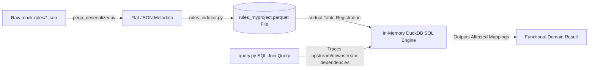
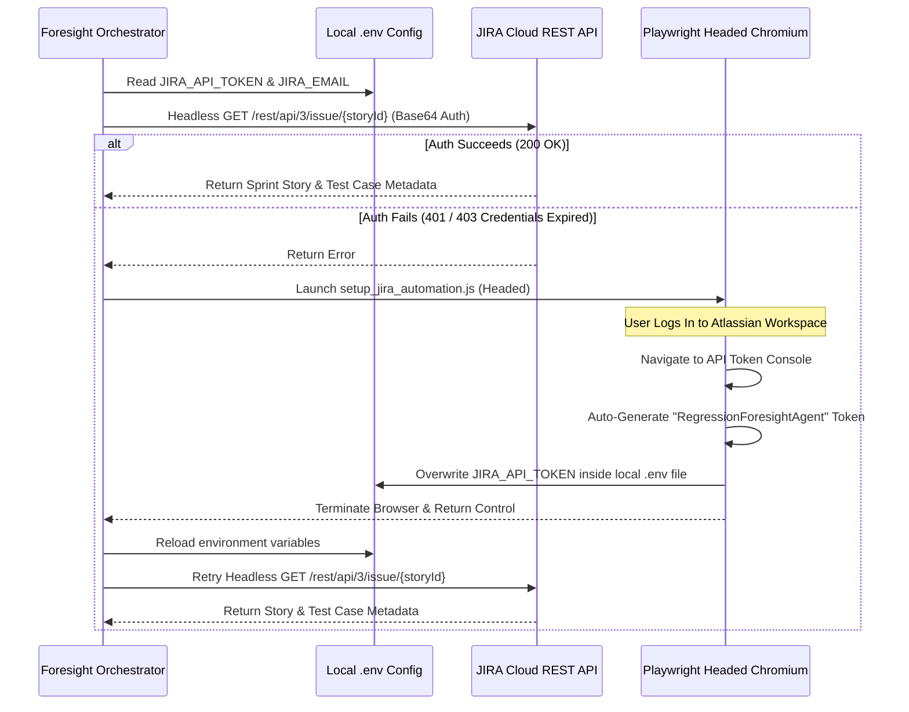
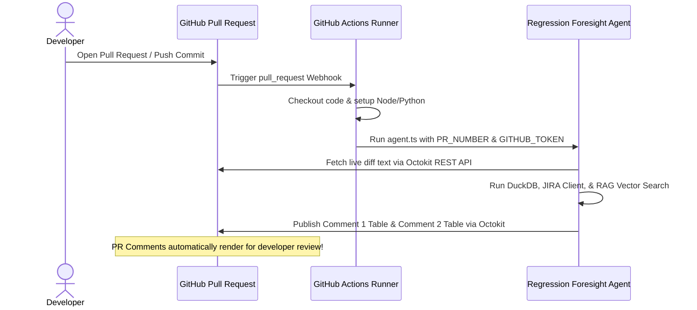

# 🗺️ Regression Foresight Agent: Phase-by-Phase Architecture Changes

This document details the step-by-step architectural transformations and technical details of the **Regression Foresight Agent** as it moves through its implementation phases. It serves as your master blueprint to explain system-level modifications, data structures, and pipeline interfaces to engineering managers and hiring teams.

---

## 🏗️ Phase 1: Environment & Codebase Architecture (Foundational)

In this starting phase, we establish a clean, dual-language project structure that separates data processing (Python) from integration orchestration (TypeScript).

### 🔍 Architectural Design
```
   [ TypeScript / Node.js Context ]          [ Python 3.13 / Data Context ]
   ├── src/ (API & Orchestration)            ├── rule-indexer/ (Metadata Engine)
   │   ├── agent.ts                          │   ├── pega_deserializer.py
   │   └── jira-client.ts                    │   ├── rules_indexer.py
   └── package.json (Node Dependencies)      │   └── requirements.txt (Python Libs)
                                             └── mock-rules/ (JSON Rules Metadata)
```

### ⚙️ Technical Details
1. **TypeScript Orchestrator Setup (`package.json`, `tsconfig.json`)**:
   - Manages Node dependencies: `@octokit/rest` (GitHub REST client), `dotenv` (secure env parsing), `playwright` (E2E headed backup browser).
   - TypeScript targets `es2022` with `commonjs` module resolution for maximum compatibility with serverless runners and local executors.
2. **Python Data Engine Setup (`rule-indexer/requirements.txt`)**:
   - Isolates the data extraction layer: `duckdb` (serverless relational database), `pandas` (tabular processing), `pyarrow` (Parquet storage library), `pymongo` (MongoDB Atlas connectivity), and `requests` (HTTP embeddings interface).
3. **Structured Mocks Directory (`mock-rules/`)**:
   - Houses JSON metadata mimicking complex enterprise rules (e.g., campaign filters, decision strategies).

---

## 📊 Phase 2: Relational Metadata Indexing (Python + DuckDB Engine)

This phase implements the local relational database engine. We transform raw JSON files into highly optimized tabular columns and execute fast, memory-based SQL joins to trace system-level change impacts.

### 🔍 Relational Ingestion & Tracing Flow


### ⚙️ Technical Details
1. **Extraction (`rule-indexer/pega_deserializer.py`)**:
   - Recursively scans `mock-rules/` directories.
   - Extracts structured key-value pairs from nested JSON models:
     - `ruleName`: Unique identifier.
     - `ruleType`: Decision Strategy, Decision Table, or Proposition Filter.
     - `channel`: Email, Web, SMS, or Mobile.
     - `parentStrategy`: Downstream rule context.
     - `lastModified`: Change checking.
2. **Compilation (`rule-indexer/rules_indexer.py`)**:
   - Collects extracted structures into a flat tabular format.
   - Saves records into a columnar, compressed binary Parquet database at **`.index/rules_myproject.parquet`**. Columnar storage ensures microsecond lookup times on massive rule indices.
3. **Relational Dependencies Tracing (`rule-indexer/query.py`)**:
   - Boots up a temporary **in-memory DuckDB session**.
   - Registers `.index/rules_myproject.parquet` as a virtual SQL table.
   - Executes SQL self-joins to recursively find all parent strategies dependent on modified child rules:
     ```sql
     SELECT r1.ruleName, r1.channel, r1.parentStrategy 
     FROM rules_table r1
     JOIN rules_table r2 ON r1.parentStrategy = r2.ruleName
     WHERE r2.ruleName = ?
     ```

---

## ⚡ Phase 3: JIRA Cloud Integration (API-First + Playwright Fallback)

This phase establishes the external JIRA integration, ensuring resilient and lightning-fast developer workflows by separating headless REST execution from headed user automation.

### 🔍 Resilient Auth Architecture


### ⚙️ Technical Details
1. **API-First Headless Client (`src/jira-client.ts`)**:
   - Connects to Atlassian via Node `fetch` calls.
   - Implements Base64 basic authentication (`Buffer.from(email + ":" + token).toString('base64')`).
   - If offline or on connection error, seamlessly handles fallback to local offline mocks `mock-jira-cases.json` to prevent pipeline crashes.
2. **Headed Playwright Backup Browser (`rule-indexer/setup_jira_automation.js`)**:
   - Utilizes `playwright` package to spin up headed Chromium.
   - Monitors navigation: once login completes, guides page to Atlassian developer profile settings.
   - Clicks "Create API Token", enters the standard label, scrapes the secret string, writes it directly into the `.env` on your local filesystem, and closes the browser securely.

---

## 🧠 Phase 4: RAG Vector Search & Ingestion (Mistral + MongoDB Atlas)

This phase replaces fragile, literal keyword lookups with a highly advanced **Retrieval-Augmented Generation (RAG)** semantic search pipeline. Changing rules are mapped to manual and automated test suites based on meaning rather than exact strings.

### 🔍 RAG Vector Search Flow
```mermaid
flowchart TD
    subgraph Data Ingestion Phase (rag_ingest.py)
        A[E-Commerce Test Suites & Specs] -->|Combine fields| B[Text Document: ID + Module + Steps]
        B -->|Mistral API mistral-embed| C[1024-Dimension Numerical Vector]
        C -->|pymongo Insert| D[(MongoDB Atlas Database)]
    end
    
    subgraph Similarity Retrieval Phase (rag_search.py)
        E[Orchestrator Plain-Text Checkpoints] -->|Mistral API| F[1024-Dimension Query Vector]
        F -->|Vector Cosine Similarity Search| D
        D -->|Retrieve Top Candidates| G[Raw Matches]
        G -->|Groq API LLaMA3 Reranker| H[Final Scoped E2E Playwright Scripts]
    end
```

### ⚙️ Technical Details
1. **Embeddings & Dimensionality**:
   - Embeddings are generated using the **Mistral API** (`mistral-embed` endpoint).
   - Generates high-resolution **1024-dimension** numerical vectors representing the semantic definition of the manual test cases and automated Playwright files.
2. **Vector Database Configuration (MongoDB Atlas)**:
   - Configures a vector search index matching the exact TestLeaf `testcases-vector-index.json` schema:
     - Vector field: `embedding` (numDimensions: 1024, similarity: cosine).
     - Filter fields: `id`, `module`, `title`, `description`, `steps`, `expectedResults`.
3. **Ingestion Engine (`rule-indexer/rag_ingest.py`)**:
   - Reads testing documents from your filesystem.
   - Strips code tags, formats the plain-text body, calls Mistral to get vector lists, and stores documents inside MongoDB Atlas collections.
4. **Retrieval Engine (`rule-indexer/rag_search.py`)**:
   - Performs a vector similarity database call, ranking results using **Cosine Similarity**:
     $$\text{Cosine Similarity} = \frac{\mathbf{A} \cdot \mathbf{B}}{\|\mathbf{A}\| \|\mathbf{B}\|}$$
   - **Reranker Integration (Groq API)**: Feeds search outputs into LLaMA3 to filter false positives and build clean, actionable markdown lists.

---

## 🔄 Phase 5: Local Orchestration & Scenario Validation

This phase aggregates all standalone components (Git diffing, DuckDB relational tracing, JIRA Cloud, and RAG retrieval) into a unified local execution loop.

### 🔍 Local Execution Flow
```
   [ Local Workspace C:\Users\lenovo\RegressionForesightAgent ]
   ├── mock-pr-diff.txt (Diff file input)
   └── npm run run-agent
       ├── 1. Read diff text
       ├── 2. Trigger rule-indexer/query.py (Traces DuckDB dependency schema)
       ├── 3. Execute src/jira-client.ts (API / Playwright fallback)
       ├── 4. Call rule-indexer/rag_search.py (MongoDB Atlas vector search)
       ├── 5. Generate validation report inside dist/ folder:
       │      ├── dist/comment1-test-plan.md
       │      └── dist/comment2-regression.md
       └── 6. Output ValidateXxxTests.groovy for offline CI profiling
```

### ⚙️ Technical Details
1. **Diff Ingestion**:
   - Looks for `mock-pr-diff.txt` in the root workspace.
   - Scenario 1 tests Email rule changes; Scenario 2 tests credit eligibility limit modifications.
2. **Output Compilers**:
   - **Comment 1 Markdown**: Contains detailed developer tables detailing modified rules, affected channels, linked JIRA story IDs, and plain-English manual test descriptions.
   - **Comment 2 Markdown**: Details the scoped automated testing table (Playwright spec files, tagged execution steps) along with a terminal execution command (e.g., `npx playwright test --grep @cismoke`).

---

## 🚀 Phase 6: Live GitHub Pipeline Activation (GitHub Actions & Octokit)

This final phase transitions the local execution model into a fully automated, cloud-based continuous integration (CI) service.

### 🔍 CI/CD Pipeline Flow


### ⚙️ Technical Details
1. **GitHub Workflow Configuration (`.github/workflows/foresight-agent.yml`)**:
   - Configures trigger events on `pull_request` to `master`.
   - Provisions a local environment with both Node.js and Python.
   - Sets secure environment tokens (`PR_NUMBER`, `REPO_OWNER`, `REPO_NAME`, `GITHUB_TOKEN`).
2. **Octokit PR Reporting Loop**:
   - Uses `@octokit/rest` to connect directly to the GitHub REST API.
   - Executes `octokit.issues.createComment` to publish the generated Markdown test plans directly as an interactive dashboard on the pull request interface.
   - Eliminates manual E2E scoping decisions, giving developers immediate feedback on target code impact.
