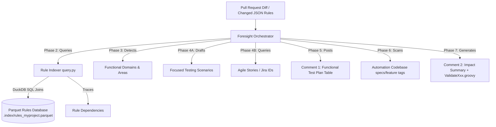

# 🚀 Regression Foresight Agent: AI-Powered Test Scoping & PR Validation Engine

[](https://www.typescriptlang.org/)
[](https://www.python.org/)
[](https://duckdb.org/)
[](https://playwright.dev/)

**Regression Foresight Agent** is a cutting-edge quality engineering agent designed to automate change-impact mapping and targeted E2E automation runs in modern software delivery pipelines. 

Re-engineered from enterprise structures, this public model consists of two core components working in tandem:
1. **Rule Indexer**: A Python-based database compiler that deserializes metadata-driven business rules (JSON) and registers them into ultra-efficient **Parquet database tables** using Pandas/PyArrow/Polars.
2. **Orchestrator Agent**: A TypeScript/Node.js engine that intercepts Pull Request diffs, queries the Parquet tables via **DuckDB SQL** to trace code dependencies, maps the changes to functional domains, drafts targeted test scenarios, scans playwirght/BDD automation tagging, publishes two structured comments back to the PR, and outputs selective CI runners.

---

## 🏛️ System Architecture Flowchart



---

## ✨ Features

- 📂 **Multi-Language Pipeline**: Combines the high-performance data processing of Python (Pandas/Polars/DuckDB) with the streamlined orchestrator execution of TypeScript.
- 🗄️ **Parquet & DuckDB Scoper**: Indexes application components and executes high-speed relational joins on rules metadata in memory, mapping upstream modifications to downstream dependencies.
- 🧪 **Functional Scenario Generator**: Automatically generates 5-8 highly target scenarios per impacted area, complete with expected outcomes and keywords.
- 🎯 **BDD & Playwright Tag Scanner**: Scans automation suites for matching annotations (`@cismoke`, `@ciregression`) to selectively filter regression suites.
- 📊 **Dual-Comment PR Exporter**: Automatically prints Comment 1 (Test Plan & Agile Story IDs) and Comment 2 (Existing automation coverage & Groovy pipelines) locally or directly onto GitHub.

---

## 🚀 Quick Start Guide

### 1. Configure the Python Rule Indexer
Navigate to the repository, install Python requirements, and compile the Parquet metadata indexes:
```bash
# Install dependencies
pip install -r rule-indexer/requirements.txt

# Run indexer to parse JSON mock rules and build Parquet files in .index/
python rule-indexer/rules_indexer.py
```
*This creates the compressed index tables: `rules_myproject.parquet` and `rulereferences_myproject.parquet` inside the `.index` folder!*

### 2. Run the Query Engine (Optional Test)
Validate the DuckDB SQL query pipeline:
```bash
python rule-indexer/query.py mzAddChannelWrapper
```

### 3. Run the Foresight Orchestration Agent
Navigate to the root directory, install Node packages, and run the 11-step agent pipeline:
```bash
# Install node packages
npm install

# Run the pipeline
npm run run-agent
```

---

## 📁 Repository Structure

- `rule-indexer/`
  - `requirements.txt`: Python libraries (`duckdb, pandas, pyarrow, polars`).
  - `metadata_deserializer.py`: Decodes raw rules metadata.
  - `rules_indexer.py`: Compiles JSON rules into Parquet database tables.
  - `query.py`: Executes DuckDB SQL joins on rule dependency parameters.
- `src/`
  - `agent.ts`: The main orchestrator script executing the 11-step pipeline.
- `mock-rules/`: JSON metadata files representing business eligibility strategies.
- `tests/`: BDD Cucumber or Playwright E2E automation suites.
- `dist/`: Locally generated PR markdown comment templates and Groovy pipeline scripts.
- `SKILL.md`: The agent's step-by-step instruction manual.

---
*Re-engineered and built by **Reshma Pathan** - Lead SDET & AI Automation Architect*
